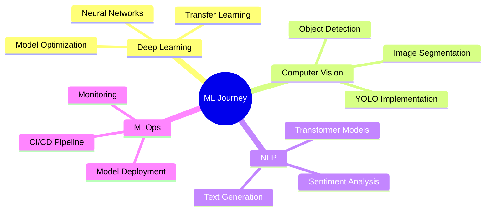

<div align="center">
  
# 👋 Halo, Saya Moh. Faried Al Farizi


[](https://www.linkedin.com/in/mohfariedalfarizi/)
[](mailto:fariedfarizi24@gmail.com)
[](https://github.com/ziee2)

</div>

---

## 🚀 Tentang Saya

```python
class MachineLearningEngineer:
    def __init__(self):
        self.name = "Moh. Faried Al Farizi"
        self.role = "AI Engineer"
        self.current_focus = ["Computer Vision", "NLP", "Deep Learning"]
        self.learning = ["AI Model Optimization", "MLOps", "Production Deployment"]
        
    def say_hi(self):
        print("Terima kasih sudah mengunjungi profil saya!")
        print("Mari berkolaborasi dan berbagi ilmu di dunia AI!")

me = MachineLearningEngineer()
me.say_hi()
```

🎯 **Saat ini saya sedang:**
- 🔬 Mengembangkan berbagai proyek **Machine Learning** dan **Deep Learning**
- 📚 Mendalami **NLP**, **Computer Vision**, dan **AI Model Optimization**
- 🎓 Menjalankan program **Bangkit Academy Cohort 2024**
- 🌱 Terus belajar tentang **MLOps** dan **Production-Ready AI Systems**

💡 **Saya terbuka untuk:**
- Kolaborasi dalam proyek **AI/ML** yang challenging
- Diskusi tentang **model optimization** dan **algorithm improvement**
- Berbagi knowledge tentang **Python**, **ML deployment**, dan **best practices**

---

## 🛠️ Tech Stack & Tools

### 💻 Languages


### 🤖 Machine Learning & Deep Learning


### 📊 Data Science & Analysis


### ☁️ Cloud & Tools


---

## 📊 GitHub Statistics

<div align="center">
  


</div>

---

## 🏆 GitHub Trophies

<div align="center">
  


</div>

---

## 🔥 Featured Projects

<!-- Tambahkan proyek favorit Anda di sini -->
<!-- Contoh format:

### 🎯 [Nama Project](link-ke-repo)
> Deskripsi singkat tentang project Anda

**Tech Stack:** `Python` `TensorFlow` `OpenCV` `Flask`

**Highlights:**
- ✨ Fitur utama 1
- 🚀 Fitur utama 2
- 💡 Achievement atau hasil

---

-->

<div align="center">
  
### 💼 Tambahkan proyek-proyek terbaik Anda di sini!

_"The best way to predict the future is to create it." - Abraham Lincoln_

</div>

---

## 📈 Contribution Graph

<div align="center">
  


</div>

---

## 🎯 Current Focus & Goals 2024



---

## 💬 Mari Terhubung!

<div align="center">

Saya selalu terbuka untuk diskusi tentang **Machine Learning**, **AI**, dan **teknologi** secara umum!

📧 **Email:** [fariedfarizi24@gmail.com](mailto:fariedfarizi24@gmail.com)  
💼 **LinkedIn:** [Klik di sini](https://www.linkedin.com/in/mohfariedalfarizi/)  
🌐 **Portfolio:** [Klik di sini](https://ziee2.github.io/portofolio/)

### ⚡ Fun Fact
> Saya sangat menikmati tantangan dalam mengoptimalkan model ML dan menemukan pola tersembunyi dalam data! 🔍✨

---


**Terima kasih sudah mengunjungi profil saya! 🙏**

_Last Updated: 2025_

</div>
