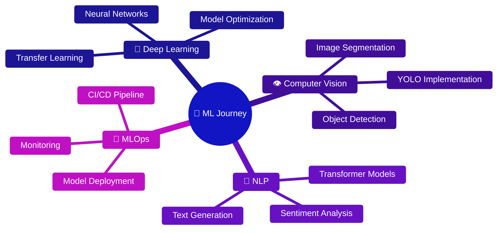

<div align="center">


<br/>

[](https://www.linkedin.com/in/mohfariedalfarizi/)
[](mailto:fariedfarizi24@gmail.com)
[](https://portofolio-one-amber-56.vercel.app/)
[](https://github.com/ziee2)

</div>


## 🚀 Tentang Saya

```python
class MachineLearningEngineer:
    def __init__(self):
        self.name = "Moh. Faried Al Farizi"
        self.role = "AI Engineer"
        self.location = "Indonesia 🇮🇩"
        self.current_focus = ["Computer Vision", "NLP", "Deep Learning"]
        self.learning = ["AI Model Optimization", "MLOps", "Production Deployment"]
        self.fun_fact = "Suka menemukan pola tersembunyi dalam data 🔍✨"

    def say_hi(self):
        print("Terima kasih sudah mampir ke profil saya!")
        print("Yuk berkolaborasi & berbagi ilmu di dunia AI 🚀")

me = MachineLearningEngineer()
me.say_hi()
```

<table>
<tr>
<td width="50%" valign="top">

### 🎯 Sedang Dikerjakan
- 🔬 Mengembangkan proyek **Machine Learning** & **Deep Learning**
- 📚 Mendalami **NLP**, **Computer Vision**, dan **AI Model Optimization**
- 🎓 Menjalankan **Bangkit Academy Cohort 2024**
- 🌱 Belajar **MLOps** & sistem AI production-ready

</td>
<td width="50%" valign="top">

### 💡 Terbuka Untuk
- 🤝 Kolaborasi proyek **AI/ML** yang menantang
- 💬 Diskusi seputar **model optimization**
- 📖 Berbagi ilmu **Python**, **ML deployment**, best practices
- 🌐 Networking dengan sesama praktisi AI

</td>
</tr>
</table>


## 🛠️ Tech Stack & Tools

<div align="center">

**Languages**


**Machine Learning & Deep Learning**


**Data Science & Analysis**


**Cloud & Tools**


</div>


## 📊 GitHub Statistics

<div align="center">


</div>

## 🏆 GitHub Trophies

<div align="center">

</div>

## 📈 Contribution Activity

<div align="center">

</div>


## 🔥 Featured Projects

> 💼 Ganti bagian di bawah ini dengan proyek unggulan kamu — format ini siap pakai, tinggal isi.

<table>
<tr>
<td width="50%">

### 🎯 [Nama Project Kamu](https://github.com/ziee2)
Deskripsi singkat yang menjelaskan masalah yang diselesaikan proyek ini dan dampaknya.

`Python` `TensorFlow` `OpenCV` `Flask`

**Highlights:**
- ✨ Fitur / arsitektur utama
- 🚀 Hasil (akurasi, performa, dsb.)
- 💡 Insight atau pembelajaran penting

</td>
<td width="50%">

### 🎯 [Nama Project Kamu](https://github.com/ziee2)
Deskripsi singkat yang menjelaskan masalah yang diselesaikan proyek ini dan dampaknya.

`Python` `PyTorch` `NLP` `Transformers`

**Highlights:**
- ✨ Fitur / arsitektur utama
- 🚀 Hasil (akurasi, performa, dsb.)
- 💡 Insight atau pembelajaran penting

</td>
</tr>
</table>

<div align="center">

_"The best way to predict the future is to create it." — Abraham Lincoln_

</div>


## 🎯 ML Journey Roadmap

<div align="center">



</div>


## 💬 Mari Terhubung!

<div align="center">

Saya selalu terbuka untuk diskusi tentang **Machine Learning**, **AI**, dan **teknologi** secara umum!

[](mailto:fariedfarizi24@gmail.com)
[](https://www.linkedin.com/in/mohfariedalfarizi/)
[](https://portofolio-one-amber-56.vercel.app/)

### ⚡ Fun Fact
> Saya sangat menikmati tantangan dalam mengoptimalkan model ML dan menemukan pola tersembunyi dalam data! 🔍✨

<br/>


**Terima kasih sudah mengunjungi profil saya! 🙏**

_Last Updated: 2026_

</div>
